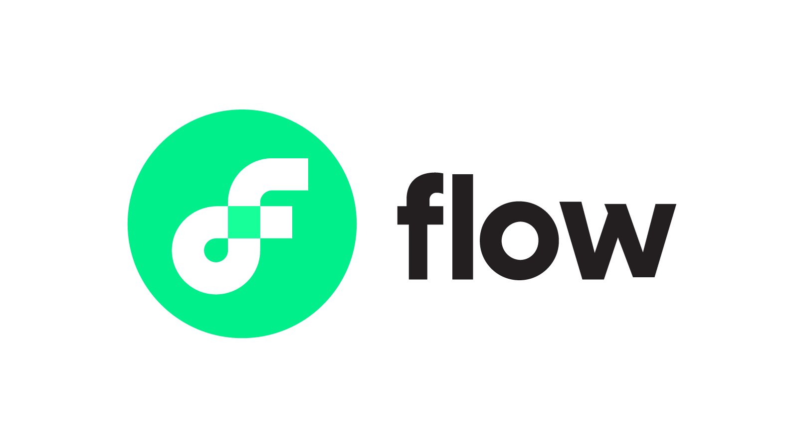
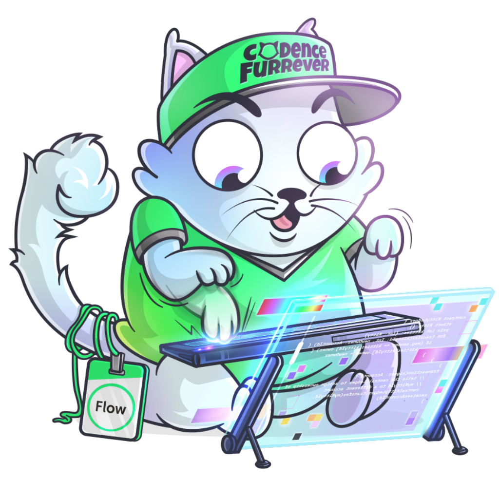
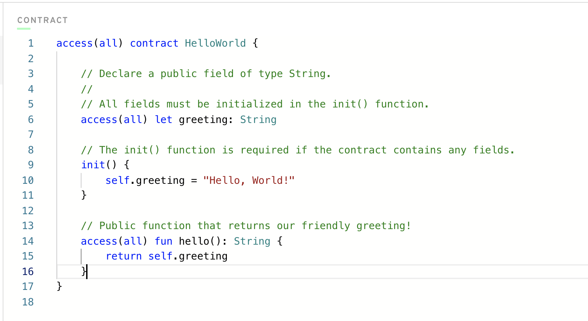

# Capítulo 1 - Dia 2 - Flow Blockchain & Cadence

Falaaa pessoal! Agora que aprendemos o que é Blockchain, no Dia 2 vamos falar por que decidimos aprender Flow Blockchain e como comparar com outras blockchains.

## Video

Se voce prefere aprender com video, pode acessar o link abaixo.

[Introducao a Flow e Cadence](https://www.youtube.com/watch?v=_aC4lQ8ICJg)

## Flow Blockchain

Flow Blockchain é a melhor. Boom! Está dito.

### Breve História

Flow Blockchain é relativamente nova. Eu diria que não se tornou conhecido até o verão de 2020, quando a equipe Flow começou a mostrá-lo ao mundo e as pessoas se interessaram. A Dapper Labs, a empresa proprietária da Flow, criou originalmente o famoso [CryptoKitties DApp](https://www.cryptokitties.co/) que cresceu para níveis insanos de popularidade nos anos anteriores. Na verdade, eu diria que o CryptoKitties foi uma das primeiras coisas "blockchainy" que o mundo realmente adotou, o que foi um grande negócio para a indústria.

Depois que o Dapper Labs teve imenso sucesso com o CryptoKitties, que estava no Ethereum, eles também começaram a ver alguns problemas com o Ethereum e o Solidity, que é a linguagem de programação Smart Contract para muitos Blockchains na Ethereum Virtual Machine (EVM). Assim nasceu a Cadence.

### Fatos sobre Flow

- É muito, muito, MUITO mais barato que o Ethereum para fazer coisas. Exemplo, no Ethereum, se você tentar alterar os dados no Blockchain por meio de uma transação (explicada no dia 1), pode custar em média cerca de 80$ dolares. No entanto, no Flow, eles nem tinham custos de transação até outubro de 2021 e, agora, as transações custam frações de centavo. Assim, o Flow é muito mais acessível para criar DApps em nível de produção para o usuário médio.
- É muito novo, então ainda há muitas coisas sendo aprimoradas. Isso significa que haverá bugs aqui e ali, mas vamos trabalhar com eles juntos. Isso também significa que é a oportunidade perfeita para aprender Flow e Cadence agora.
- Quase não há recursos de aprendizado para começar a usar o Flow. Por isso, este curso.
- Houve muitos DApps de sucesso no Flow, incluindo [NBATopShot](https://nbatopshot.com/), que foi (e ainda é) um grande sucesso.

## Cadence

Cadence é a linguagem de programação Smart Contract para o Flow Blockchain. Ou seja, o código que você escreverá para fazer Smart Contracts neste curso estará no Cadence.

Como o Flow foi amplamente fundado para resolver alguns dos problemas do Ethereum, os elementos fundamentais do Cadence são respostas/melhorias (alguns argumentariam contra isso, mas aceitem como quiserem) ao Solidity. Estes estão listados abaixo.

Os fundamentos, ou melhor, "Pilares da Linguagem de Programação Cadence":
1. **Segurança e Proteção**: Todo Contrato Inteligente deve ser seguro. A Cadence maximiza a eficiência enquanto mantém os mais altos níveis de segurança e proteção. Ele consegue isso por causa de seu sistema de tipos insanamente forte, separação entre contratos e transações e Programação Orientada a Recursos (veja #5).
2. **Clareza**: O código deve ser fácil de ler, especialmente o código do Smart Contract para que nós, como usuários, possamos verificar se é seguro. Isso é alcançado tornando o código declarativo e permitindo que o desenvolvedor expresse suas intenções diretamente. O Cadence deixa essas intenções muito claras por design, o que, juntamente com a legibilidade, torna a auditoria e a revisão mais eficientes.
3. **Acessibilidade**: A forma como o Cadence é escrito é muito familiar para outras linguagens de programação, facilitando a transição se você tiver experiência anterior.
4. **Experiência do desenvolvedor**: O desenvolvedor deve ser capaz de depurar de maneira fácil, entender o que faz onde e não se sentir frustrado. Cadence faz isso tornando as mensagens de erro muito claras.
5. **Programação Orientada a Recursos**: Esta é de longe a mais importante e tomará cerca de 80% do nosso tempo neste curso. Cadence em sua essência usa coisas chamadas `Recursos`, e eles definem praticamente tudo o que fazemos no Flow. Não vou entrar nisso agora, porque em algum momento teremos uma lição inteira sobre `Recursos`.

*Você pode vê-los mais detalhadamente no site do Flow [aqui](https://docs.onflow.org/cadence/#cadences-programming-language-pillars).*

Se você não entender isso, tudo bem. Abordaremos esses tópicos ao longo de todo o curso e você aprenderá por que cada um deles é tão crucial para a Cadence.

## Conclusão

E por hoje é só! No dia seguinte, começaremos a entrar em algum código Cadence.

# Questões

Sinta-se à vontade para responder no idioma de sua escolha.

1. Quais são os 5 Pilares da Linguagem de Programação Cadence?

2. Na sua opinião, mesmo sem saber nada sobre Blockchain ou codificação, por que os 5 Pilares podem ser úteis (você não precisa responder isso para #5)?